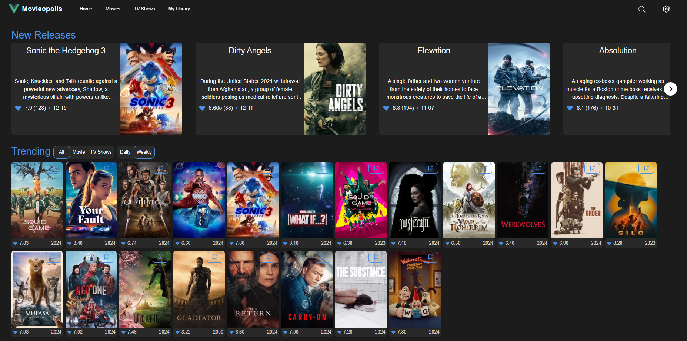
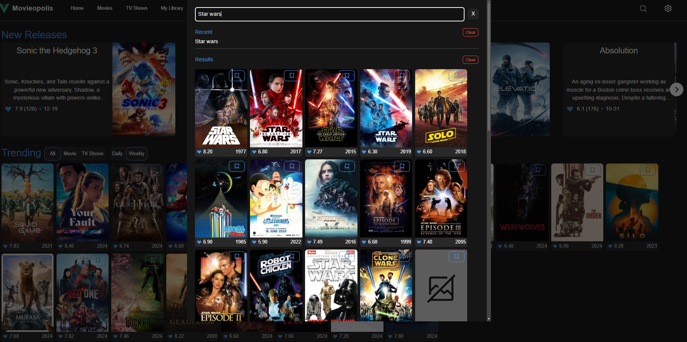

# Movieopolis Project

Movieopolis is a web application that provides users with a dynamic streaming service experience, offering a comprehensive catalog of movies and TV shows. Leveraging the TMDB API, it delivers detailed information such as synopses, ratings, and genres, allowing users to explore and discover content seamlessly.

## Features

- **Extensive Catalog**: Access a wide range of movies and TV shows with up-to-date information.
- **Search Functionality**: Easily find specific titles or browse by genre and category.
- **Discovery Option**: Discover movies or tv shows using user defined filters.
- **Responsive Design**: Enjoy a user-friendly experience across various devices.

## Live Demo

Check out the live application: [Movieopolis](https://movieopolis-714f2.web.app/home)

## Technology Stack

- **Frontend**: Vue.js
- **Backend**: Django
- **API**: TMDB (The Movie Database API)

## Repositories

- Frontend repository: [https://github.com/ClassyExit/TMDB_Frontend](https://github.com/ClassyExit/TMDB_Frontend)
- Backend repository: [https://github.com/ClassyExit/TMDB_Backend](https://github.com/ClassyExit/TMDB_Backend)

#### Backend:

The backend was written in Python using the Django framework. Python was chosen for its rather simplicity in writing and reading code as well as the rich and diverse support in terms of libraries. The purpose of the backend was to rely information and handle any data manipulation from the TMDB API to the frontend using API endpoints.

#### Frontend:

The selected choice to build the frontend was Vuejs due to my experience with it. The data stored on the frontend was handled using Pinia, a state management library.

## What I learned

- Breaking down problems into smaller problems
- Working with lots of data and displaying it
- UI/UX design, Tailwind CSS
- - Making it accessible/responsive on all screens
- Getting more comfortable using JavaScript (Asynchronous functions, API calls) and Python

## Future Improvements

- Optimization
- - Duplicate code
- - Hosting is setup to incur the lowest cost
- Make searchbar more usable in terms if UI (displaying results) and functionality
- Make the discover better (add in keywords, multiple genres options)
- UI/UX Improvements
- - More responsive on different screens (mostly layout and double blocks of code that do the samething on mobile vs web)
- Use more reusable components (will help clean up code)

## Screenshots

- Can view more photos of project located in the ProjectImages folder

